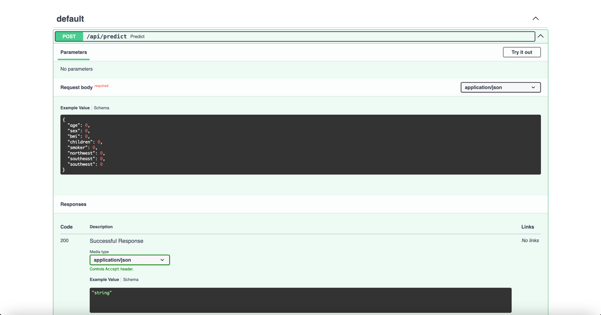

# Insurance Prediction API (FastAPI)
This project provides an API for predicting insurance charges based on user input using a trained machine learning model.

## Table of Contents
- [Description](#description)
- [Requirements](#requirements)
- [Getting Started](#getting-started)
  - [1. Train and Save the Model](#1-train-and-save-the-model)
  - [2. Deploy FastAPI](#2-deploy-fastapi)
- [Endpoints](#endpoints)
- [Example Input and Output](#example-input-and-output)
- [File Structure](#file-structure)
- [License](#license)

## Description

The FastAPI application loads the trained Logistic Regression model and exposes an endpoint for predicting insurance charges based on user's input. The model is trained on the following features:

- Age
- Gender
- BMI
- Number of Children
- Smoker Status
- Region

The API predicts insurance charges in USD based on these features.


## Requirements
To set up and run this project, you’ll need the following Python packages:

- `fastapi`
- `uvicorn`
- `scikit-learn`
- `pandas`
- `joblib`
- `numpy`
- `xgboost`

You can install these dependencies by running:
```bash
pip install -r requirements.txt
```

## Getting Started
1. Train and Save Model

  Train the XGBoost Regression model using Scikit-Learn and XGBoost Regressor and save the trained model to files for deployment:
  ```bash
  python model_build.py
  ```
  This will create the `model.pkl` file in the `model/` directory.


2. The FastAPI application (`api.py`) loads the saved model and provides an endpoint for predictions. Run it using `uvicorn`:
  ```bash
  uvicorn api:app --reload
  ```
  This will start the FastAPI server at `http://127.0.0.1:8000`


## Endpoints


- POST /api/predict
  - Description: Accepts insurance feature values and returns a predicted insurance charges in $.
  - Input JSON:
  ```bash
  {
    "age": 30,
    "gender": male,
    "bmi": 25.3,
    "children": 4,
    "smoker": no,
    "region": "southwest"
  }
  ```
  - Output JSON:
  ```bash
  {
    "predicted_charges": 5000.78
  }
  ```

## Example Input and Output
Example Input:

Age = 45  
Gender = Female 
BMI = 28.7 
Number of Children = 2
Smoker Status = Yes  
Region = Southeast

Example Output:

Predicted Insurance Charges: $17,900.55 


## File Structure
The project directory is structured as follows:

```
📦 XGBoostRegressor API
├─ data
│  └─ data.csv
├─ model
│  └─ model.pkl
├─ src
├─ .gitignore
├─ api.py
├─ model_build.py
├─ README.md
└─ requirements.txt
```
## License
This project is licensed under [](https://opensource.org/licenses/MIT)